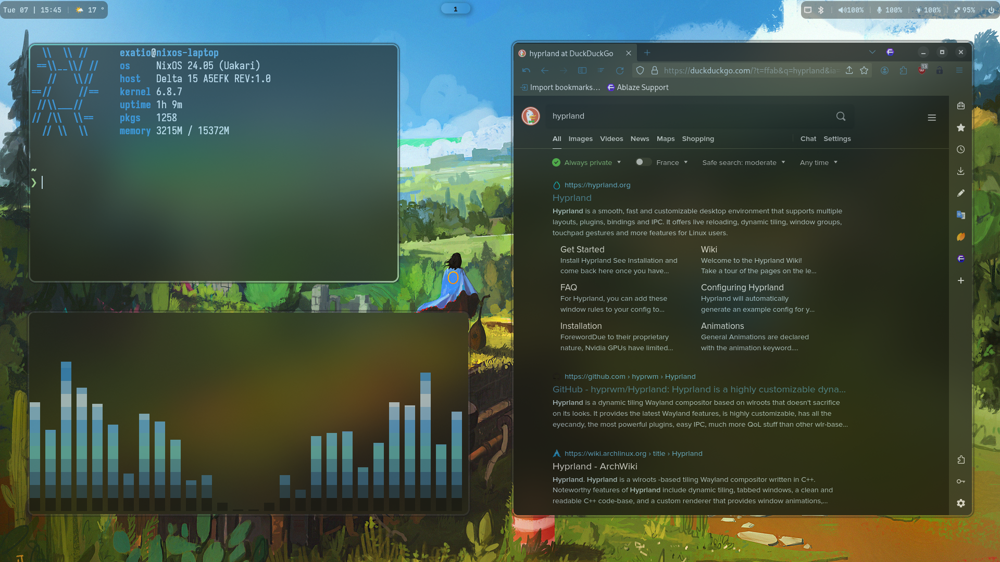
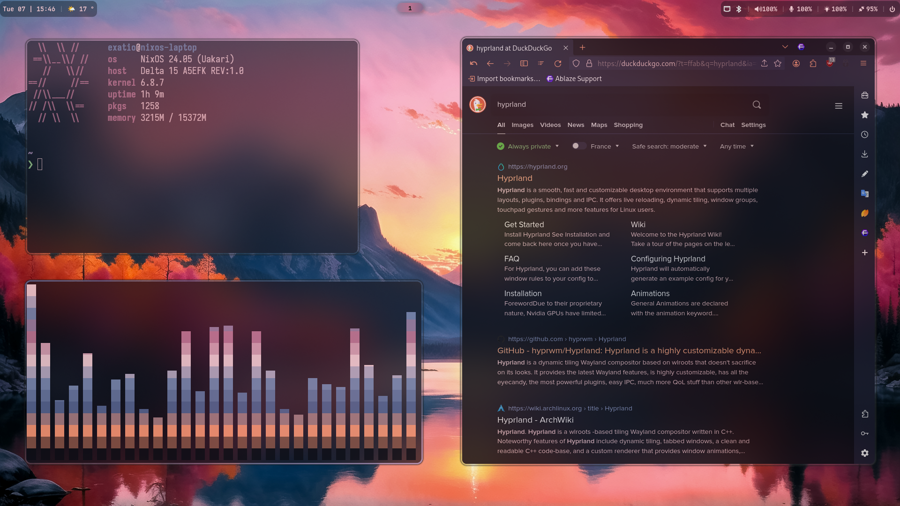
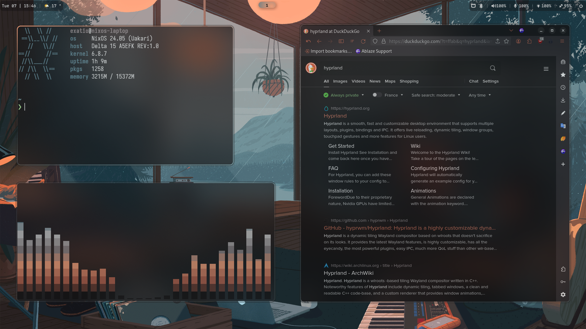
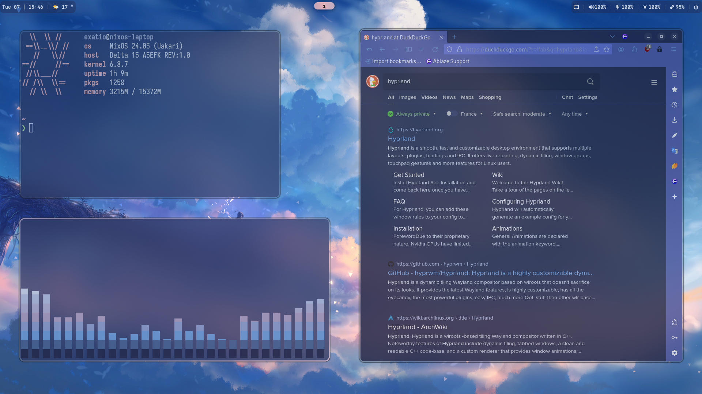

# HyprFlake - My NixOS Hyprland config with Pywal !
This repo contains my dotfiles for my Hyprland with Pywal setup on my NixOS system.

## Preview

## Setup

- OS: [NixOS](https://nixos.org)
- Window manager: [Hyprland](https://github.com/hyprwm/Hyprland)
- Status bar: [Waybar](https://github.com/Alexays/Waybar)
- Terminals: [Kitty](https://github.com/kovidgoyal/kitty) & [Alacritty](https://github.com/alacritty/alacritty)
- Shell: [Zsh]( https://www.zsh.org/)
- Current theme: [Pywal](https://github.com/dylanaraps/pywal)

## Gallery

|                                               |                                                      |
| :-------------------------------------------: | :--------------------------------------------------: |
|  |           |
|  |  |

More Pywal screenshots

|                                               |                                               |
| :-------------------------------------------: | :-------------------------------------------: |
|  |  |
|  |  |
|  |  |

## Installation

This flake is not ready-to-go, and is not meant to be for the moment.
This section will be updated in the future.
You need some prior NixOS knowledge to use this setup.
A lot of options have to be modified according to your system, so you have to go through the setup to understand how it works and what to change.

## Acknowledgements

### Nix
- [Dileep Kishore's nix config](https://github.com/dileep-kishore/nixos-hyprland) : Structure, reference

### Hyprland
- [Ja Koolit's setup](https://github.com/JaKooLit/Hyprland-Dots): Structure, reference, scripts
- [Stephan Raabe's setup](https://gitlab.com/stephan-raabe/dotfiles): Reference, scripts
